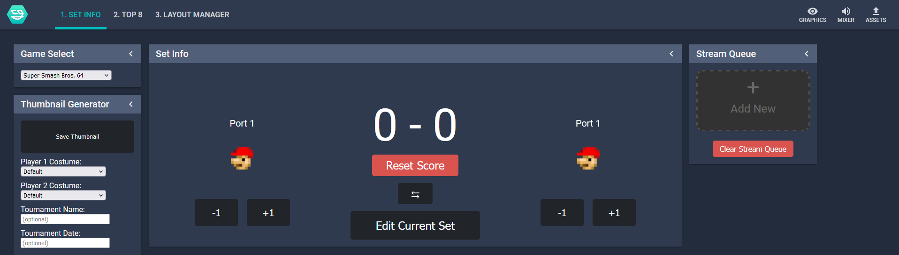
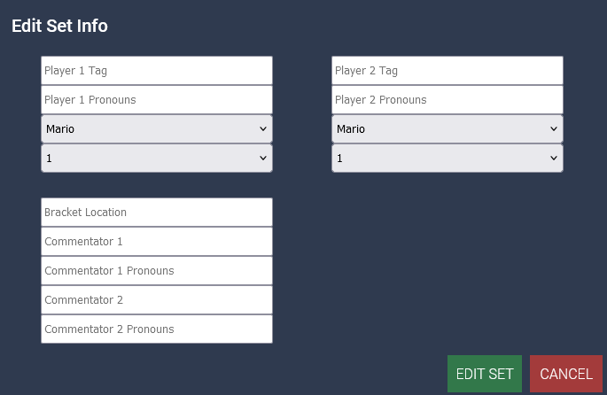
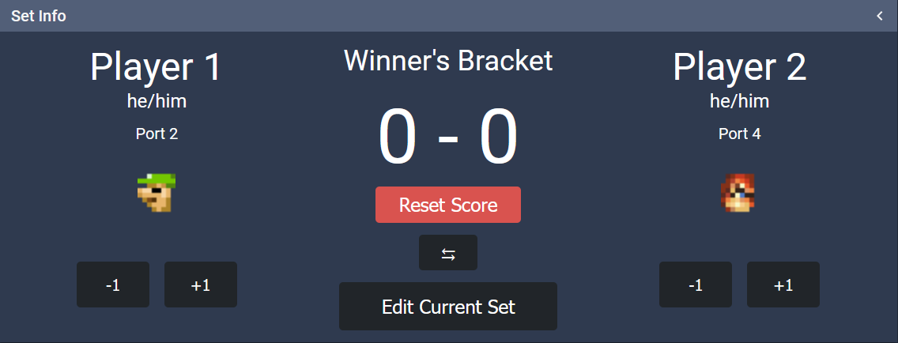
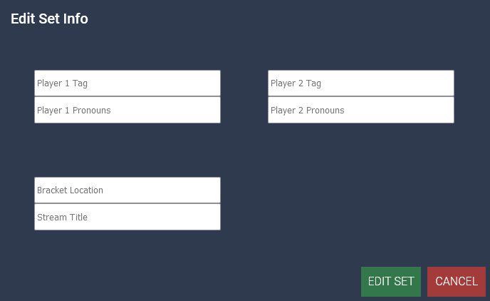
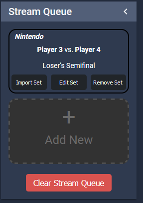
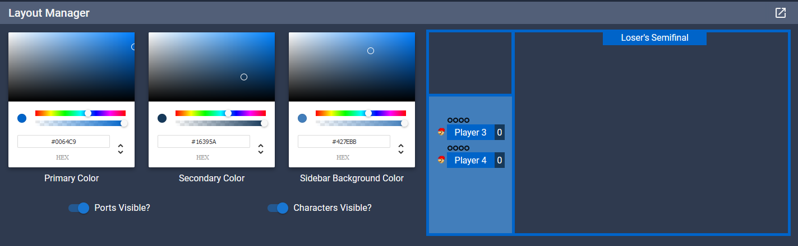

# nodecg-smashcontrol-react
---
This is a bundle for [NodeCG](https://www.nodecg.dev/), it is required for use. 

nodecg-smashcontrol, or smashcontrol, is a NodeCG application designed to serve the use of Super Smash Bros. tournament streaming, by making inputting information for a given set easier, to avoid other options like text through OBS. 

This bundle does not come with any graphics in itself. Some examples can be found here: 
[rit-graphics-react](https://github.com/swc19/rit-graphics-react)
[default-64-graphics](https://github.com/swc19/default-64-graphics)
[neutral-tilt-graphics-react](https://github.com/swc19/neutral-tilt-graphics-react)

Developing graphics for smashcontrol does require some knowledge in React, but the repositories above should provide a framework for what is necessary, as well as the required replicants (NodeCG's cross-bundle states that persist across program runs). 


## Installation
To begin using smashcontrol, you must have both [Node](https://github.com/swc19/neutral-tilt-graphics-react) and [git](https://git-scm.com/) installed. Then, install NodeCG:
```
npm install --global nodecg-cli@latest
mkdir nodecg
cd nodecg
nodecg setup
```

Once setup is complete, install this bundle:
`nodecg install smashcontrol/nodecg-smashcontrol-react`
and any graphics bundles you may be using. 

You will next need to build the bundle using yarn. If you do not have yarn, you can install it using the following command:  
`npm install --global yarn`  
Then navigate to the bundle install directory and build it:  
```
cd bundles/nodecg-smashcontrol-react
yarn build
```  

You may have to run `npm install` once in this directory if you're getting build errors.

Finally, start NodeCG using `nodecg start`, and navigate to `localhost:9090` in your browser. Smashcontrol is tested to work in Firefox and Google Chrome.

## How to Use

To begin, you will be greeted with this screen: 

There are multiple Panels and workspaces here:
**Game Select**: This lets you choose from any Smash game (or Rivals of Aether). This is primarily used when you are selecting a character for a player, for displaying on stream or use elsewhere. 
**Thumbnail Generator**: This is a way to automatically generate thumbnails given the current players names, and location in bracket. This panel simply sends off a signal to an external set of graphics, best shown [in this usage.](https://github.com/swc19/neutral-tilt-graphics-react/blob/master/src/graphics/thumbnail/ThumbnailObject.jsx)
**Set Info**: This is the primary panel you'll be interacting with, as it contains the player names, characters, place in bracket, and scores. To begin editing, click on `Edit Current Set`, upon which a modal will appear:
.
Once this is filled out and Saved via clicking `Edit Set`, the modal will close and the Set Info panel will be updated:

Scoring can be changed by clicking the +/- 1 buttons underneath each player, and their relative positions can be swapped by clicking the ⇆ button.

**Stream Queue**: The Stream Queue panel also opens a modal when clicked: 

Once this is filled out and `Edit Set` is clicked, it will show up in the sidebar: 

You can then click `Import Set` to replace whatever is in Set Info with the details of that set (there is no warning for this), `Edit Set` to edit the details, and `Remove Set` to remove it from the queue. `Clear Stream Queue` at the bottom immediately removes all sets from the queue, again with no warning.

The stream queue can hold as many sets in it as you'd like, but it will begin separating sets by pages once 4 are on the main screen. As sets are imported or removed, the queue would move up, as expected.


## Top 8
The top 8 workspace, indicated as `2. Top 8` in the top bar, is a relatively bare bones top 8 generator. Again, this requires additional graphics to implement, but serves an easier way to automatically import the tags, mains, secondaries (optional) of your top 8 players, as well as the tournament info.  

## Layout Manager
*Note: This is currently only used with the [default-64-graphics](http://localhost:9090/bundles/default-64-graphics/graphics/layout.html) package. it is possible to use with other graphics packages, but additional setup may be required.*

In conjunction with the default-64-graphics package, this tab offers a quick and easy way to change the colors and some settings of a preset layout. This is done via three color pickers: 
One is for the primary color, which includes the border, top bar and nameplates. The Secondary color is currently only used in the score box, and the sidebar background color is for the large space containing the nameplates, scores, ports and characters. 

The two toggles are self explanatory, toggling them off removes the indicated feature, if their use is not desired. 

## Distributed use
It is possible to use smashcontrol to control the same stream on multiple devices. This is done by obtaining the host pc (the one running NodeCG)'s IP address, and entering that into the address bar instead of `localhost`. It is worth noting that the package is not developed for mobile use, but does work on mobile devices. This method also may not work on managed internet networks (i.e. school wifi). 